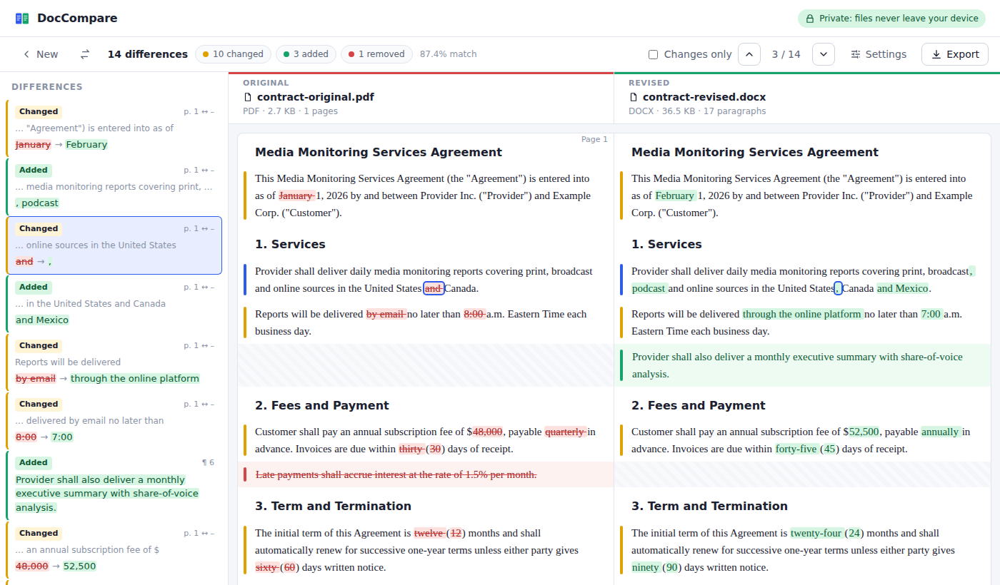

# DocCompare: secure side-by-side document comparison

A subscription web app for comparing two versions of a document, modeled on the "Compare Documents" feature in ABBYY FineReader PDF. Documents are read and compared **inside each user's browser**: they are never uploaded, stored or sent to a third party. Accounts, team workspaces, optional saved review progress and per-seat Stripe billing are handled by a small server that never sees document content.



## Features

| | |
|---|---|
| **Formats** | PDF (text-based), Word `.docx`, HTML, plain text/Markdown. Any combination, e.g. PDF vs Word. |
| **Side-by-side view** | Original and revised are shown in aligned rows. Changed paragraphs line up; added and removed paragraphs sit next to a hatched gap. |
| **Highlighting** | Removed text is red with strikethrough, added text is green, and changed paragraphs get an amber margin bar. Highlighting can be word-level or character-level. |
| **List of differences** | Every change is listed with its type (Changed / Added / Removed), page number and surrounding context. Click an item to jump to it. |
| **Navigation** | Previous/next buttons and the keyboard shortcuts `j`/`k`, `↓`/`↑` or `n`/`p`. Clicking a highlight selects it. |
| **Filters** | Show or hide each change type. "Changes only" collapses unchanged paragraphs. |
| **Comparison settings** | Ignore case, ignore punctuation, ignore spacing/line wrapping. Curly and straight quotes and dash variants are always treated as equal. |
| **Export** | A self-contained HTML report (summary, list of differences, full side-by-side view and **SHA-256 hashes** of both files for audit), a CSV of the differences, or Print / Save as PDF. |
| **Smart grouping** | Similar paragraphs are paired even when paragraphs are inserted around them. Amounts like `$48,000` or `7:00` are treated as single words. Edits separated only by punctuation (`twelve (12)` → `twenty-four (24)`) count as one change. |

### Teams and subscriptions

| | |
|---|---|
| **Sign-in** | Email and password (12+ characters, email confirmation required), one-time email sign-in links, "Sign in with Microsoft" and "Sign in with Google", optional two-step verification (authenticator app, with backup codes), and password reset. |
| **Workspaces** | Each customer is a workspace. Owners and admins invite colleagues by email and choose Member or Admin roles; people accept by following the emailed link. |
| **Billing** | Stripe Checkout with a per-seat monthly (and optional yearly) plan and a free trial. The seat count follows the number of members automatically. Owners and admins manage cards and invoices in the Stripe billing portal. Workspaces without an active or trial subscription are locked. |
| **Optional saving** | Chosen before each comparison. **Don't save** records nothing. **Log activity** records who compared which files, when. **Save review progress** also stores review marks and notes. In every case only file names, sizes, SHA-256 fingerprints and counts are stored, never document text. |
| **Review progress** | Mark each change ✓ Reviewed or ⚑ Flagged and add a note (keys `r` and `f`). Progress ("9/14 reviewed · 1 flagged") is shared with the team. |
| **No duplicate work** | When two files are selected, their fingerprints are checked against the workspace history. If a teammate already compared them (in either order), a banner offers to continue their review. |
| **History** | A list of saved comparisons with who, when and review progress, plus a team activity feed (compared, reopened, reviewed, flagged, deleted). To reopen one, you select the same files again; the app verifies they match the fingerprints. |

Not included yet: OCR for scanned PDFs (the app detects them and asks for an OCR'd copy), legacy `.doc` files, and formatting-only changes such as bold or font.

## Security model

- **Documents stay client-side.** PDF parsing (PDF.js), Word parsing (mammoth) and the diff all run in the browser tab. The API accepts only small JSON bodies (64 KB limit) of metadata, and the e2e tests verify that no request ever contains document text.
- **No outbound connections.** A strict Content-Security-Policy (`connect-src 'self'`, no third-party scripts, fonts or CDNs) makes it technically impossible for the page to send document content elsewhere. PDF.js workers, fonts and character maps are bundled and served from the same origin.
- **No document persistence.** Documents are held in memory only. Clicking "New" drops them. Saving (off by default) stores metadata, fingerprints and review marks. Review marks are keyed by a hash of each change, not its text. Notes are the only free text, and people write those themselves.
- **Accounts.** [Better Auth](https://www.better-auth.com) handles passwords, sessions, email verification, 2FA, OAuth, rate limiting and organization roles. Every API query is scoped to the caller's workspace, and tests check that one workspace can't read or change another's data.
- **CSRF.** Every state-changing request must carry this app's own `Origin`.
- **No markup injection.** Document text is always inserted as text nodes, never as HTML. HTML and DOCX input is parsed into an inert DOM (scripts never run). CSV exports are protected against spreadsheet formula injection.
- **Hardened PDF parsing.** PDF.js is pinned to a patched release (≥ 6.2.108, fixing GHSA-hq66-cqwq-w95j), with XFA and font-face loading disabled. `npm audit` runs in CI.
- **Hardened server.** Every response carries CSP, HSTS (in production), `X-Frame-Options: DENY`, `nosniff`, `Referrer-Policy: no-referrer` and COOP/CORP headers. The container runs as a non-root user.

The e2e test suite checks that comparing documents makes **zero** requests to any other origin and triggers no CSP violations.

See [SECURITY.md](SECURITY.md) for deployment guidance.

## Getting started

Requires Node.js 22+ and PostgreSQL 14+.

```bash
npm install
createdb doccompare                        # or: docker compose up db
export DATABASE_URL=postgres://localhost/doccompare
npm run build && npm start                 # http://localhost:3000
```

With no Stripe, Resend or OAuth settings, the app runs in development mode: billing is off, and emails (confirmation links, invitations) are printed to the server log instead of being sent. For live-reloading work on the interface, run `npm run dev:server` and `npm run dev` together, then open http://localhost:5173.

The start screen has a **Try the sample contracts** button. Sample files in PDF, Word and text are in [`samples/`](samples/) (regenerate them with `python3 samples/generate.py`).

```bash
npm test             # unit tests (diff engine, PDF layout analysis)
npm run test:server  # API tests against Postgres (TEST_DATABASE_URL)
npm run test:e2e     # browser tests (Playwright): sign-up, team review hand-off, comparisons
npm run build        # dist/ (web app) + dist-server/ (API server)
```

## Deploying

Configuration is by environment variables; [`.env.example`](.env.example) documents each one.

**Managed hosting (recommended to start).** [`render.yaml`](render.yaml) is a one-click Render blueprint: the Docker web service plus a managed Postgres, about $20–30/month to start. The same image runs on Fly.io, Railway, Azure Container Apps or AWS App Runner with any managed Postgres (Neon, Supabase, RDS).

**Self-hosted.** `cp .env.example .env`, fill it in, then run `docker compose up -d`. This runs the app on port 3000 plus Postgres. Put it behind your TLS terminator.

The server creates and updates its tables on start (additive changes only). Health check: `GET /healthz`.

### Launch checklist

1. **Domain and HTTPS.** Set `BASE_URL` to the public URL.
2. **Email.** Create a [Resend](https://resend.com) account, verify your sending domain, then set `RESEND_API_KEY` and `EMAIL_FROM`.
3. **Stripe.**
   - Create a product with a *per-unit* recurring price for one seat (monthly, and optionally yearly), and set `STRIPE_PRICE_MONTHLY` / `STRIPE_PRICE_ANNUAL`.
   - Add a webhook endpoint at `{BASE_URL}/api/auth/stripe/webhook` for `checkout.session.completed` and `customer.subscription.created/updated/deleted`, and set `STRIPE_WEBHOOK_SECRET`.
   - Turn on the customer portal in Stripe settings.
   - Test the whole flow in Stripe test mode first.
4. **Microsoft / Google sign-in (optional).** Register an app in Microsoft Entra ID and/or Google Cloud with the redirect URIs listed in `.env.example`.
5. **Your first customer.** Sign up, create the workspace (e.g. "Cision"), start the trial, and invite the 3–4 users from the Team page.

`npm run build:single` still produces `dist-single/doccompare.html`, a standalone, account-free copy of the comparison tool in one file (no saving or teams).

## Project layout

```
src/
  compare/engine.ts     paragraph alignment + word/char diff, change numbering
  compare/normalize.ts  tokenizer, normalization options, similarity
  extract/              PDF (pdf.js + layout analysis), DOCX (mammoth), HTML, text
  ui/viewer.ts          side-by-side view, differences list, navigation, review marks
  account/              sign-in, workspace, plan, team, history and account screens
  report.ts             HTML/CSV export
  main.ts               app shell: routing, saving, resuming
server/
  auth.ts               Better Auth: email, magic link, OAuth, 2FA, organizations, Stripe
  api.ts                workspace API: saved comparisons, reviews, activity, lookup
  app.ts                Hono app: security headers, CSRF, static files
  migrate.ts            database schema
e2e/                    Playwright tests
tests/                  Vitest unit tests; tests/server: API tests against Postgres
```

### How the comparison works

1. Each file is converted into **blocks**: paragraphs, headings, list items and table cells. For PDFs, text runs are regrouped into lines and paragraphs using their position, gaps between lines and font size. Hyphenation and paragraphs that continue across a page break are rejoined.
2. Blocks are normalized according to the settings and aligned with an LCS diff.
3. Within each run of removed and added blocks, pairs are matched by word similarity using an order-preserving optimal alignment. A matched pair becomes a *modified* paragraph; unmatched blocks are *added* or *removed*.
4. Modified paragraphs get a word-level (or character-level) diff. Adjacent edits become numbered changes that are linked across both sides, the list and the report.
